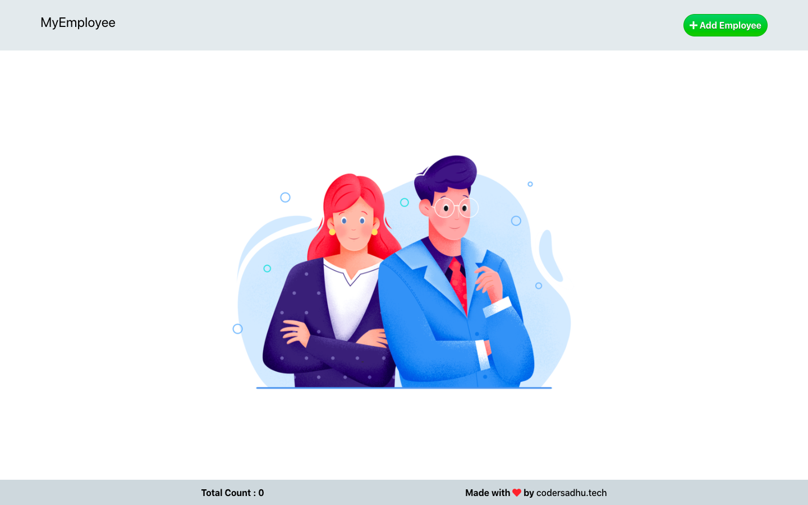

# Employee Management System - Saarthi.ai

- [x] frontend  - Netlify
- [x] frontend  - Heroku

## Problem Statement
FRONT-END WEB DEVELOPER ASSESSMENT

### Instructions:

1. Create a Button - New Employee
2. On click of New Employee Button a FORM should pop up asking below input to be filled:
*  Name - text field
*  Employee ID - text field.
*  Department - dropdown , add any five values.
*  Email Id - text
*  Date of Joining(DOJ) - add calendar to select date. f Submit Details - a button to submit data.
*  Clear - a button to clear form data.
  On click of Submit Details button, FORM should get closed and a dynamic table gets
3. created on same page with all the table field and data mentioned in step2(a-e).

*  Form should not get submitted with empty data. 
*  Empty entry error message should be thrown. 
*  Table should be scrollable with fixed header row.

4. A cross. button gets generated at each table row to delete any entry dynamically, deleted entry should get reflected immediately.


5. Complete application should be responsive. 
6. Styling should be done in CSS.
7. Technology to Use :- HTML/CSS/Javascript/jQuery OR Angular/React.
 
Note: Create separate file for HTML/CSS/Javascript(Angular/React) and for application logic

## Demo Link
Open Here  - 
[ **Demo Netlify** ](https://elegant-elion-24e194.netlify.app/)

### Tech / Stack:

 - HTML5
 - CSS3 
 - JavaScript
 - React 
 - Redux
 
### Features implemented:
- [x] Add Employee
- [x] Delete Employee
- [x] Custom Modal
- [x] Toasts
- [x] React Calendar

## Required UI : 

 

## My UI :

Step 1 :

Step 2 : 
 

Step 3 : 
 

Step 4 : 
 

 

 

 

 

This project was bootstrapped with [Create React App](https://github.com/facebook/create-react-app).

## Available Scripts

In the project directory, you can run:

### `npm install`
### `npm start`

Runs the app in the development mode. 
Open [http://localhost:3000](http://localhost:3000) to view it in the browser.

The page will reload if you make edits. 
You will also see any lint errors in the console.
 - Truck Tracking System with Realtime API - Remote State
